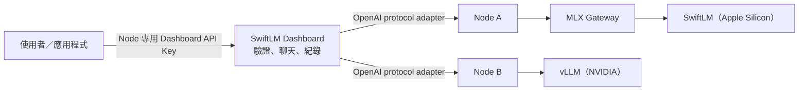

# SwiftLM Platform

這是一個完整的本機 LLM API 平台：本機 Apple Silicon 負責模型推理，Zeabur Wonder Mesh 提供外網連線，Dashboard 負責客戶 API key、聊天、使用紀錄與模型機器狀態。

本機模型使用 SwiftLM 的 SSD expert streaming 執行：

`majentik/Qwen3.6-35B-A3B-TurboQuant-MLX-4bit`

## 最簡單的用法

```zsh
cd ~/Desktop/mlx-server
./mlx start
./mlx status
./mlx test
./mlx logs engine
./mlx logs requests
./mlx stop
```

也可以從 Finder 雙擊：

- `start.command`：啟動
- `stop.command`：停止

查看所有指令：

```zsh
./mlx help
```

## 網址

- 本機 Gateway：`http://127.0.0.1:18124/v1`
- SwiftLM Direct（內部）：`http://127.0.0.1:18123/v1`
- Client API：`https://richard-swiftlm.zeabur.app/v1`
- SwiftLM origin：`https://richard-swiftlm-origin-7165.zeabur.app/v1`

Client API 使用 Dashboard 產生的 `sk-mlx-...` key。Origin 只供 Dashboard 與管理測試使用，使用 SwiftLM master key。

## 重要檔案

- `config.env`：模型、Port、Context、記憶體與公開網址。
- `mlx`：唯一管理指令。
- `common.sh`：共用設定與模型路徑解析。
- `swiftlm-runtime/`：SwiftLM binary 與 Metal runtime。
- `mlx-gateway/`：統一入口、推理佇列、request ID 與結構化效能紀錄。可選擇性啟用 node-agent 模式（enrollment、簽章 heartbeat），見 `mlx-gateway/join.mjs` 與 [docs/inference-nodes.md](docs/inference-nodes.md)；未啟用時行為完全不變。
- `dashboard/`：Zeabur Dashboard、API gateway、聊天及 request history。
- `deploy/wondermesh/`：Wonder Mesh relay 部署檔。
- `.state/`：PID 與後台日誌。

## 兩種日誌

```zsh
./mlx logs engine
```

顯示 SwiftLM／Metal 原始輸出，適合診斷模型與崩潰；併發輸出的文字可能交錯。

```zsh
./mlx logs requests
```

顯示經過 MLX Gateway 的 running、waiting、queue time、TTFT、tokens 與 throughput。Dashboard 對話與串流 API 會在完成時保存相同的 token/s、TTFT 與排隊時間。每個請求都有獨立 request ID，不保存提示詞或完整回答。

模型保存在 `.cache/huggingface/`，目前使用的下載工具環境是 `.venv/`。

## Wonder Mesh 部署指南

完整的外網發布流程、視覺架構圖、安全邊界與故障排除請見：

[本機 API 透過 Zeabur Wonder Mesh 對外服務](docs/wonder-mesh-local-api.md)

Dashboard 的開發與部署方式請見 [dashboard/README.md](dashboard/README.md)。

## 多機器 Dashboard

Dashboard 把每一台推理節點視為一個「機器節點」，不限於 SwiftLM：Apple Silicon + SwiftLM、Linux/NVIDIA + vLLM、llama.cpp 與其他 OpenAI-compatible backend 可以並存。節點是明確選擇的，不做隱性自動分流：



- 管理員在 Dashboard 的「機器」加入機器名稱、backend、模型、節點 `/v1` URL 與驗證方式。「偵測 backend 與模型」會以一次 `/models` 請求判斷 backend 並帶出該節點已提供的模型。
- Dashboard 每 5 秒以 `/models` 檢查各節點是否在線；驗證方式為「無驗證」的私有節點不需要上游 API Key。
- 建立 API Key 時必須選擇機器；Key 只能呼叫該機器登記的模型。Client 只使用 Dashboard 發行的 `sk-mlx-*` key，不需要知道背後是哪一種 backend。
- 新對話可在尚未送出第一則訊息前選擇機器和模型；送出後固定目標，避免對話內容跨機器混用。
- API request 與對話會保存 `node_id`、模型與狀態，方便從使用紀錄追查。

上游憑證不會顯示給 Dashboard 使用者；預設 Mac mini 的 key 仍位於 Keychain 與 Dashboard 的 Zeabur secret environment variable，額外節點的憑證則只會加密保存於 Dashboard 的持久化資料庫，且預設節點的 master key 不會被借給任何其他節點。

各 backend 的差異（metrics、thinking switch、驗證方式）與節點資料模型請見：

[異質推理節點與 provider adapter](docs/inference-nodes.md)
