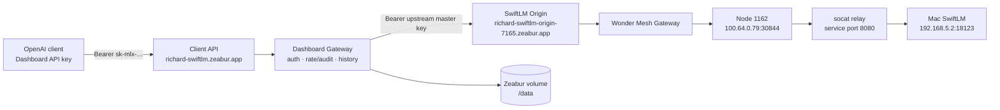
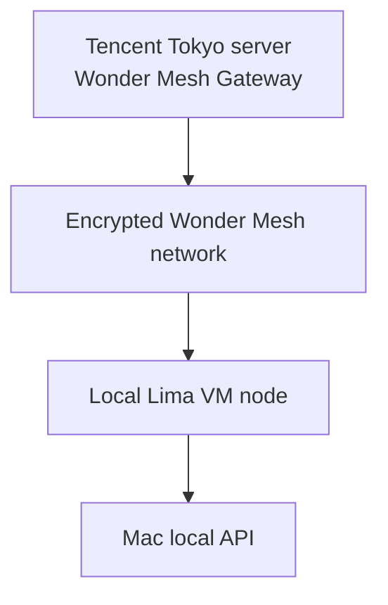
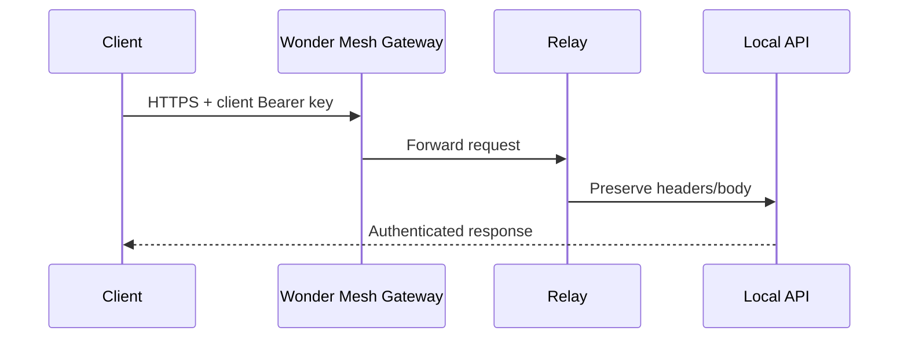
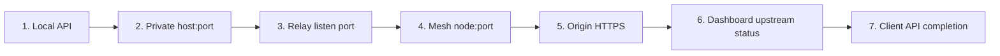
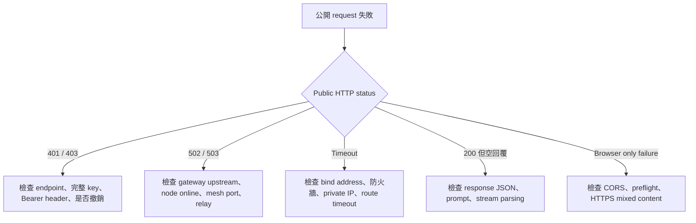

# 本機 API 透過 Zeabur Wonder Mesh 對外服務

這份指南說明如何讓仍然運行在本機電腦的 HTTP API，借用 Zeabur Wonder Mesh、App Gateway、HTTPS 網域與雲端管理層提供外網服務。流程不限定 SwiftLM，也適用 FastAPI、Express、Go、Rails、Webhook receiver 或其他 TCP/HTTP 服務。

> 核心觀念：程式與運算留在本機；Zeabur 負責安全連線、HTTPS 與公開入口。Wonder Mesh 不是把模型搬到雲端。

## 1. 架構總覽

### 1.1 通用直連架構

```mermaid
flowchart LR
    Client["外部客戶端"]
    Domain["HTTPS 公開網域"]
    Gateway["Zeabur Wonder Mesh Gateway"]
    Node["Wonder Mesh Node<br/>node ID + mesh port"]
    Forward["Zeabur Port Forwarding"]
    Relay["TCP Relay<br/>socat"]
    Local["本機 HTTP API<br/>private IP + local port"]

    Client -->|"HTTPS request"| Domain
    Domain --> Gateway
    Gateway -->|"Wonder Mesh route"| Node
    Node --> Forward
    Forward --> Relay
    Relay -->|"private LAN / VM bridge"| Local
```



這個模式適合本機 API 已經自行驗證 Bearer key 的情況。公開網域收到的 `Authorization` header 會一路傳到本機服務。

### 1.2 加入 Dashboard API Gateway

目前 SwiftLM 使用這個模式。客戶只拿到 Dashboard 發行的 key，本機 SwiftLM master key 不會交給客戶。



Client domain 與 origin domain 必須不同。若 Dashboard 的 `UPSTREAM_BASE_URL` 指回自己的 client domain，請求會形成無限代理迴圈。

## 2. 各元件的責任

| 元件 | 責任 | 不應負責 |
|---|---|---|
| 本機 API | 實際運算、模型推理或商業邏輯 | 公開 TLS、客戶 key 管理 |
| TCP relay | 將 mesh port 轉送到本機 IP/port | 驗證、修改 request body |
| Wonder Mesh | 建立雲端與本機之間的私人網路 | 執行模型或保存聊天 |
| Wonder Mesh Gateway | 將公開 hostname 對應到 node/mesh port | 取代應用層驗證 |
| Dashboard Gateway | 客戶 key、代理、稽核與聊天紀錄 | 執行模型權重 |
| Zeabur volume | 保存 API key digest、聊天與 request records | 保存明文 client key |

## 3. 部署前確認

先定義本機服務合約：

| 設定 | SwiftLM 範例 | 說明 |
|---|---|---|
| Listen address | `0.0.0.0` | VM/relay 必須能連入；必須搭配驗證與防火牆 |
| Local port | `18123` | 本機 API port |
| Private host | `192.168.5.2` | Wonder Mesh VM 可到達的 Mac 位址 |
| Health/smoke path | `/v1/models` | 不只檢查 port，也檢查應用層 |
| Authentication | Bearer master key | 保存在 macOS Keychain |
| Streaming | SSE | Gateway/relay 不可緩衝完整回覆 |
| Request timeout | 至少 `300s` | 本機推理可能需要較長時間 |

檢查本機服務：

```zsh
cd ~/Desktop/mlx-server
./mlx status
./mlx test
```

只有在本機實際 request 成功後才繼續。Listening port 並不等於 API 正常。

## 4. 建立 relay

目前 relay 設定位於：

```text
deploy/wondermesh/zeabur-template.yaml
```

核心命令是：

```yaml
source:
  image: alpine/socat:1.8.0.3
  command:
    - socat
    - -d
    - -d
    - TCP-LISTEN:8080,fork,reuseaddr
    - TCP:192.168.5.2:18123
```

調整其他服務時只需要替換：

- `8080`：relay container 的 listen port。
- `192.168.5.2`：Wonder Mesh VM 能到達的本機 private IP。
- `18123`：本機 API port。

Relay image 必須同時支援 ARM64 與 AMD64。`alpine/socat:1.8.0.3` 是目前驗證可用的 multi-architecture image。

將 template 部署到使用 Wonder Mesh region 的 Zeabur project，然後開啟 service port forwarding。記下 Zeabur 分配的 mesh port；目前實例為 `30844`。

## 5. 確認 Wonder Mesh node

在 Zeabur Wonder Mesh 畫面確認：

1. 本機或本機 VM 節點顯示 Online。
2. 記錄 node ID。
3. 記錄 Tailscale/Wonder Mesh IP。
4. 從該節點確認 private host 與 local port 可連線。

目前實例：

| 欄位 | 值 |
|---|---|
| Node name | `lima-zeabur-mesh` |
| Node ID | `1162` |
| Mesh IP | `100.64.0.79` |
| Mesh port | `30844` |
| Relay destination | `192.168.5.2:18123` |

Node ID、mesh IP 與 port 都可能在重建後改變；每次寫入 route 前必須重新讀取 live state。

## 6. 啟用 Wonder Mesh Gateway

Wonder Mesh Gateway 需要借用一台可提供 gateway 的 Zeabur server。目前 gateway 與 `Tencent Tokyo 2C 4GB` 共用，服務本身仍然運行在本機 Mac。



啟用後會建立一個 owner-level 共用 gateway。不要因為不同 API project 就重複建立 gateway；同一個 gateway 可以保存多條 hostname route。

## 7. 掛載公開網域

每條 Wonder Mesh route 需要：

- Generated/custom domain。
- Online node ID。
- Mesh port。
- 可選的 IP whitelist/blacklist。

概念上的 route：

```text
richard-swiftlm-origin-7165.zeabur.app
    -> node 1162
    -> mesh port 30844
    -> http://100.64.0.79:30844
```

Zeabur CLI 目前可以部署 relay service，但 Wonder Mesh hostname route 需要使用 Zeabur Console 或 `attachWonderMeshUpstream` GraphQL operation。Mutation 的輸入形狀如下：

```graphql
mutation AttachOrigin($input: AttachWonderMeshUpstreamInput!) {
  attachWonderMeshUpstream(input: $input) {
    routes {
      host
      nodeID
      meshPort
      upstream
    }
  }
}
```

```json
{
  "input": {
    "nodeID": "1162",
    "meshPort": 30844,
    "domainName": "richard-swiftlm-origin-7165",
    "isGenerated": true
  }
}
```

Generated domain 傳入的是不含 `.zeabur.app` 的名稱。執行 mutation 前應先查詢 `wonderMeshGateway` 與 `wonderMeshNodes`，避免重複 route 或使用離線 node。

不要把 Zeabur API token 寫進 script、repository、command history 或 mutation variables 檔案；使用已登入 CLI 或 macOS Keychain。

## 8. 選擇驗證模式

### 8.1 本機 API 直接驗證客戶 key

將公開 Wonder Mesh domain 直接提供給客戶。本機服務必須驗證每一個 request。



### 8.2 Dashboard 發行客戶 key

保留 origin domain 專供 Dashboard 使用，再把 client domain 掛到 Dashboard service：

```text
Client domain -> Dashboard -> Origin domain -> Wonder Mesh -> Local API
```

Dashboard 必要環境變數：

```text
UPSTREAM_BASE_URL=https://richard-swiftlm-origin-7165.zeabur.app/v1
UPSTREAM_API_KEY=<SwiftLM master key，Zeabur secret>
ADMIN_PASSWORD=<Zeabur secret>
SESSION_SECRET=<Zeabur secret>
KEY_HASH_SECRET=<Zeabur secret>
DATA_DIR=/data
```

Dashboard client domain：

```text
https://richard-swiftlm.zeabur.app/v1
```

客戶使用 Dashboard 發行的完整 `sk-mlx-...` key。完整 key 只顯示一次，資料庫只保存 HMAC digest 與 prefix。

## 9. 逐跳驗證

永遠從內向外驗證，停在第一個失敗的 hop：



目前 SwiftLM 的檢查：

```zsh
# 本機實際生成
./mlx test

# Wonder Mesh origin 實際生成（使用 Keychain master key）
./mlx test origin

# Client API：使用 Dashboard 發行的 key
read -s "DASHBOARD_API_KEY?貼上完整 Dashboard API key："
echo
curl -sS https://richard-swiftlm.zeabur.app/v1/models \
  -H "Authorization: Bearer ${DASHBOARD_API_KEY}"
unset DASHBOARD_API_KEY
```

完成條件：

- 未授權 request 回 `401` 或 `403`。
- 有效 key 的 `/models` 回 `200`。
- 實際 application request 成功，不只 health check。
- SSE/WebSocket 能逐段傳送，不只最後得到完整 response。
- Zeabur restart 後 key、聊天與 request history 仍存在。

## 10. 故障定位



| 症狀 | 最可能的原因 |
|---|---|
| 本機 connection refused | 程序未啟動、port 錯誤、只 bind 到錯誤 interface |
| 本機正常但 VM 連不到 | `127.0.0.1` bind、Mac firewall、private IP 錯誤 |
| Relay 正常但 public `502` | node/mesh port 錯誤、Wonder Mesh upstream 類型錯誤 |
| Dashboard `502` | origin 離線、`UPSTREAM_BASE_URL` 錯誤、master key 不一致 |
| Dashboard key 顯示 invalid | 使用了 prefix、打到 origin domain、key 已撤銷 |
| Streaming 卡住 | proxy buffering、idle timeout、SSE headers 不完整 |
| 重啟後所有舊 key 失效 | `KEY_HASH_SECRET` 改變或資料 volume 未掛載 |

## 11. 安全原則

1. 本機服務 bind `0.0.0.0` 時必須啟用驗證與防火牆。
2. SwiftLM master key 只放 macOS Keychain 與 Dashboard 的 Zeabur secret variable。
3. 客戶 key 與 upstream master key 必須分離。
4. 不要執行 `zeabur project export` 檢查含 secrets 的 project；輸出可能含明文變數。
5. 不要把 API key、Zeabur token、`.env`、SQLite、logs 或 request body 提交到 Git。
6. API 內容記錄應有保留期限與關閉選項；prompt/response 可能包含敏感資料。
7. Route、domain、gateway、volume 或 API key 的刪除都應先確認精確 target。

## 12. 目前部署清單

| 項目 | 目前值 |
|---|---|
| Local project | `~/Desktop/mlx-server` |
| Local model API | `http://127.0.0.1:18123/v1` |
| Client API | `https://richard-swiftlm.zeabur.app/v1` |
| SwiftLM origin | `https://richard-swiftlm-origin-7165.zeabur.app/v1` |
| Wonder Mesh node | `1162` / `lima-zeabur-mesh` |
| Mesh endpoint | `100.64.0.79:30844` |
| Relay image | `alpine/socat:1.8.0.3` |
| Dashboard service | Tencent Tokyo / persistent `/data` |
| Local model | `majentik/Qwen3.6-35B-A3B-TurboQuant-MLX-4bit` |

這些識別資訊是目前實例的快照。重建或搬機時先重新探索 live state，再更新這份表格與 `config.env`。
